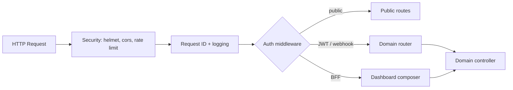

# 2 — API Gateway Structure

## Role

The gateway is the **single public HTTP entry** for browser apps, mobile, and messaging webhooks. It does not own business rules; it **terminates TLS, authenticates, routes, rate-limits, and aggregates** (BFF) where needed.

## Deployment shape (phase 1)

One Node process: `apps/api-gateway` importing domain packages. Not a separate Kong/Nginx service until traffic or multi-team ownership demands it.

## URL layout

```
/health                          # liveness — no auth
/ready                           # readiness — DB + Redis ping
/api/v1                          # meta catalog (existing pattern)
/api/v1/auth/*                   # login, refresh, me
/api/v1/patients/*               # core
/api/v1/crm/*                    # CRM domain
/api/v1/nursing/*                # Nursing domain
/api/v1/rehab/*                  # Rehabilitation (alias /rehabilitation for compat)
/api/v1/dashboard/*              # BFF read APIs
/api/v1/ai/*                     # sync AI endpoints (thin); heavy jobs async
/api/v1/notifications/*          # admin: templates, delivery status
/webhooks/telegram                 # provider ingress — signature auth, not JWT
/webhooks/whatsapp
```

**Compatibility:** Mount `rehab` and `rehabilitation` to the same router during migration from `wmc-ai-backend`.

## Gateway layers



### Middleware order (`createApp`)

1. `helmet`, `cors`, `express.json` (size limit per route group)
2. `requestId` + structured logger
3. `rateLimiter` — stricter on `/auth/login`, `/webhooks/*`
4. `apiAuthMiddleware` on `/api/v1` (exclude meta catalog + login)
5. Domain routers
6. `errorHandler` — consistent `{ error, code, requestId }`

### Route registration (`apps/api-gateway/src/routes/index.ts`)

```typescript
// Conceptual — implementation later
api.use(metaRouter)
api.use('/auth', createAuthRouter(deps))
api.use('/patients', createPatientsRouter(deps))
api.use('/crm', createCrmRouter(deps))
api.use('/nursing', createNursingRouter(deps))
api.use('/rehab', createRehabRouter(deps))
api.use('/dashboard', createDashboardRouter(deps))
api.use('/ai', createAiRouter(deps))
api.use('/notifications', createNotificationsAdminRouter(deps))

app.use('/webhooks/telegram', telegramWebhookRouter) // separate auth
app.use('/webhooks/whatsapp', whatsappWebhookRouter)
```

## BFF vs domain APIs

| Type | Path example | Purpose |
|------|----------------|---------|
| Domain CRUD | `PATCH /api/v1/nursing/alerts/:id` | Single aggregate write |
| BFF read | `GET /api/v1/dashboard/command-center` | Join nursing + rehab + CRM metrics |
| BFF read | `GET /api/v1/dashboard/telegram-snapshot` | Shape data for Telegram dashboard UI |

BFF handlers live in `apps/api-gateway/src/bff/` and call **multiple domain services** in one request. Avoid SQL joins across schemas in BFF — use domain service methods or read-model views.

## Auth zones

| Zone | Auth mechanism |
|------|----------------|
| `/api/v1/auth/login` | Public |
| `/api/v1/*` (default) | JWT Bearer |
| `/webhooks/*` | Provider signature / secret token |
| Internal worker → API | Service JWT or mTLS (phase 3) |

## Versioning

- Path version: `/api/v1` (current standard in `wmc-ai-backend`).
- Breaking changes → `/api/v2` with parallel mount for one release cycle.
- Deprecation headers: `Sunset`, `Link` to successor routes.

## Error contract

```json
{
  "error": "Human-readable message",
  "code": "NURSING_ALERT_NOT_FOUND",
  "requestId": "uuid",
  "details": {}
}
```

## OpenAPI

Generate from route metadata or maintain `shared-resources/contracts/openapi.yaml`. Gateway serves `/api/v1/openapi.json` in non-production.

## Future: external API gateway

When splitting services:

| Component | Responsibility |
|-----------|----------------|
| Kong / Traefik / AWS ALB | TLS, WAF, routing to multiple pods |
| `api-gateway` pod | Auth + BFF only |
| Domain pods | `nursing-api`, `crm-api` behind internal network |

Phase 1–2 skip this; keep one Express app.
