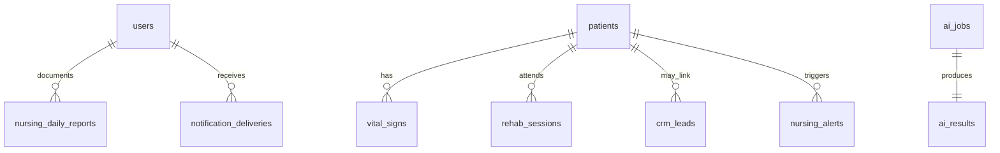

# 3 — Shared Database Structure

## Strategy

**One PostgreSQL cluster**, multiple **schemas** (logical bounded contexts). Aligns with existing `postgresql.sql` in `wmc-ai-backend` and moves migrations to `databases/migrations/`.

## Schema map

| Schema | Owns | Examples |
|--------|------|----------|
| `core` | Identity, patients, facilities | `users`, `patients`, `facilities`, `audit_log` |
| `crm` | Leads, pipeline, appointments | `crm_leads`, `appointments`, `follow_ups` |
| `nursing` | Clinical nursing ops | `nursing_daily_reports`, `vital_signs`, `nursing_alerts`, `handover_*` |
| `rehab` | Therapy | `rehab_sessions`, `rehab_goals`, `rehab_assessments` |
| `notify` | Messaging platform | `notification_outbox`, `notification_deliveries`, `channel_bindings` |
| `ai` | AI jobs & outputs | `ai_jobs`, `ai_results` (extend existing enum) |
| `dashboard` | Optional materialized views | `mv_command_center_daily`, refresh via job |

Cross-schema references use **UUID FKs** only on `core.patients` and `core.users`.

## Entity relationship (core)



## Migration from existing SQL

1. Copy `wmc-ai-backend/docs/schema/postgresql.sql` → `databases/migrations/001_core_crm_nursing_rehab.sql`
2. Add `002_notify.sql`, `003_ai_jobs.sql`, `004_dashboard_views.sql`
3. Namespace tables into schemas:

```sql
-- Example pattern
CREATE SCHEMA IF NOT EXISTS core;
CREATE SCHEMA IF NOT EXISTS nursing;

-- Move: CREATE TABLE patients → CREATE TABLE core.patients
```

## Table additions (beyond current sql file)

### `notify.notification_outbox`

| Column | Type | Notes |
|--------|------|-------|
| id | UUID PK | |
| channel | enum | `telegram`, `whatsapp`, `email`, `sms` |
| template_key | text | e.g. `family_update`, `lead_followup` |
| payload | jsonb | Render variables |
| status | enum | `pending`, `processing`, `sent`, `failed` |
| idempotency_key | text unique | Prevent duplicate sends |
| scheduled_at | timestamptz | |
| created_at | timestamptz | |

### `notify.channel_bindings`

Links `user_id` or `patient_contact_id` to Telegram chat ID / WhatsApp number.

### `ai.ai_jobs`

| Column | Type | Notes |
|--------|------|-------|
| id | UUID PK | |
| kind | ai_job_kind | Extend enum from existing file |
| status | enum | `queued`, `running`, `completed`, `failed` |
| input_ref | jsonb | `{ patientId, sourceTable, sourceId }` |
| result_id | UUID FK → ai_results | |
| requested_by | UUID FK → core.users | |

### `core.audit_log`

Append-only: `actor_id`, `action`, `resource_type`, `resource_id`, `meta jsonb`.

## Indexing guidelines

- FK columns: always index (`patient_id`, `status`, `created_at DESC`)
- Partial indexes for hot queues: `WHERE status = 'pending'` on outbox
- GIN on `jsonb` only when querying inside JSON

## Data ownership rules

| Rule | Rationale |
|------|-----------|
| CRM does not store clinical vitals | Boundary |
| Nursing does not store lead pipeline stage | Boundary |
| Patient demographics only in `core.patients` | Single master |
| AI stores **outputs** in `ai.ai_results`; source rows stay in domain tables | Traceability |
| Soft-delete patients | `deleted_at`; FK RESTRICT on clinical children |

## Connection & access

| Consumer | DB user | Schemas |
|----------|---------|---------|
| api-gateway | `wmc_api` | ALL (via search_path) |
| notification-worker | `wmc_notify` | `notify`, read `core` |
| ai-worker | `wmc_ai` | `ai`, read domain schemas |

Phase 1: single `DATABASE_URL`; split roles in phase 3.

## Redis usage (non-SQL)

| Key pattern | Use |
|-------------|-----|
| `session:{userId}` | Optional session cache |
| `ratelimit:{ip}` | Gateway |
| `bull:notify:*` | Job queue |
| `bull:ai:*` | AI job queue |
| `dashboard:snapshot:{facilityId}` | Short TTL cache for command center |

## Sheet / file mode (transitional)

Keep `SHEETS_MODE=file|google` in legacy `wmc-ai-backend` until Postgres cutover. Platform uses **Postgres only**; no dual-write long term.

## Backup & migrations

- Migrations: sequential numbered files in `databases/migrations/`
- Tool: `node-pg-migrate` or `drizzle-kit` (pick one in phase 2)
- Snapshots: existing `backups/db-snapshots/` policy
