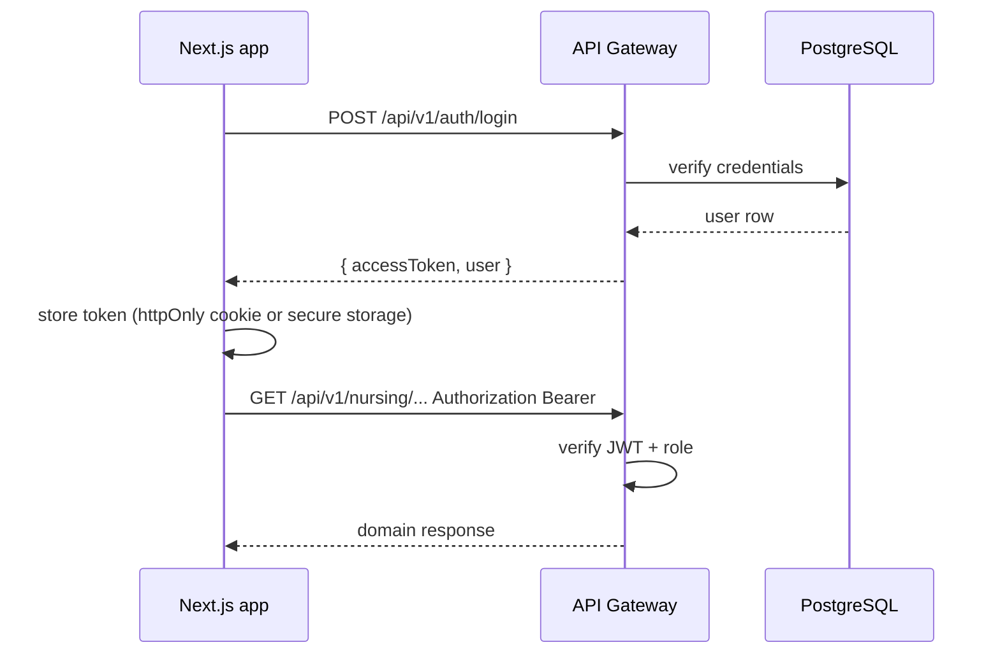

# 4 — Shared Authentication Structure

## Goals

- One login for Nursing, Rehab, CRM, and Dashboard UIs.
- **RBAC** aligned with existing roles: `admin`, `doctor`, `nurse`, `receptionist`, `therapist`.
- JWT for stateless API access; optional refresh tokens for web.
- Webhook paths use **separate** provider secrets (not user JWT).

## Package: `@wmc/shared-auth`

```
packages/shared-auth/src/
├── index.ts
├── jwt.service.ts           # sign, verify, decode
├── password.service.ts      # bcrypt compare/hash
├── rbac.ts                  # requireRoles, permission matrix
├── middleware/
│   ├── authenticate.ts      # Bearer JWT → req.user
│   ├── optionalAuth.ts
│   └── serviceAuth.ts       # worker → API (phase 3)
├── types/
│   └── auth-user.ts
└── constants/
    └── permissions.ts
```

## Token model

### Access token (JWT)

| Claim | Content |
|-------|---------|
| `sub` | `user.id` (UUID) |
| `email` | string |
| `role` | `user_role` enum |
| `facilityId` | optional multi-site |
| `iat`, `exp` | standard |

Config (from existing `env.ts` pattern):

- `JWT_SECRET` — required in production
- `JWT_EXPIRES_IN` — default `7d` for staff apps; consider `15m` + refresh for production hardening

### Refresh token (phase 2)

- Opaque token in `core.refresh_tokens` (hashed) or Redis with rotation.
- Endpoint: `POST /api/v1/auth/refresh`.

## Middleware usage

```typescript
// Gateway applies globally on /api/v1 except allowlist
const PUBLIC = [
  'GET /api/v1',           // meta catalog
  'POST /api/v1/auth/login',
]

// Per-route
router.get('/doctor-review-queue', authenticate, requireRoles('doctor', 'admin'), ...)
```

### `requireRoles(...roles)`

Reuse behavior from `wmc-ai-backend/src/middleware/auth.ts`:

- 401 if no/invalid token
- 403 if role not in list

### Demo auth (development only)

Keep `WMC_DEMO_AUTH` / `WMC_DEMO_AUTH_TOKEN` behind `NODE_ENV !== 'production'` guard; never enabled in prod config.

## Permission matrix (starter)

| Resource | admin | doctor | nurse | receptionist | therapist |
|----------|:-----:|:------:|:-----:|:------------:|:---------:|
| patients:read | ✓ | ✓ | ✓ | ✓ | ✓ |
| patients:write | ✓ | ✓ | limited | ✗ | ✗ |
| crm:* | ✓ | read | ✗ | ✓ | ✗ |
| nursing:write | ✓ | ✓ | ✓ | ✗ | ✗ |
| rehab:write | ✓ | ✓ | ✗ | ✗ | ✓ |
| ai:invoke | ✓ | ✓ | ✓ | ✓ | ✓ |
| notifications:admin | ✓ | ✗ | ✗ | ✗ | ✗ |

Expand to fine-grained `permission` strings when CRM and nursing diverge further.

## User storage

- Table: `core.users` (existing definition in `postgresql.sql`)
- Password: `password_hash` bcrypt cost 10–12
- No passwords in JWT or logs

## Cross-app SSO flow



**Recommendation:** Use **httpOnly cookie** for web apps (set by gateway) + CSRF double-submit for mutating requests; mobile/scripts keep Bearer header.

## Service accounts (workers)

| Account | Purpose |
|---------|---------|
| `wmc-notify-worker` | Poll outbox, update delivery status |
| `wmc-ai-worker` | Claim `ai_jobs`, write `ai_results` |

Authenticate with `Authorization: Bearer <SERVICE_TOKEN>` from env `WMC_SERVICE_TOKEN_*` (phase 3).

## Webhook auth (Telegram / WhatsApp)

| Provider | Validation |
|----------|------------|
| Telegram | Secret token header; validate `X-Telegram-Bot-Api-Secret-Token` |
| WhatsApp | Meta signature `X-Hub-Signature-256` |

Map inbound chat ID → `notify.channel_bindings` before enqueueing domain commands.

## Security checklist (before prod)

- [ ] Rotate `JWT_SECRET` per environment
- [ ] Rate limit login
- [ ] Audit log on auth failures and role denials
- [ ] Disable demo token
- [ ] HTTPS only at load balancer
