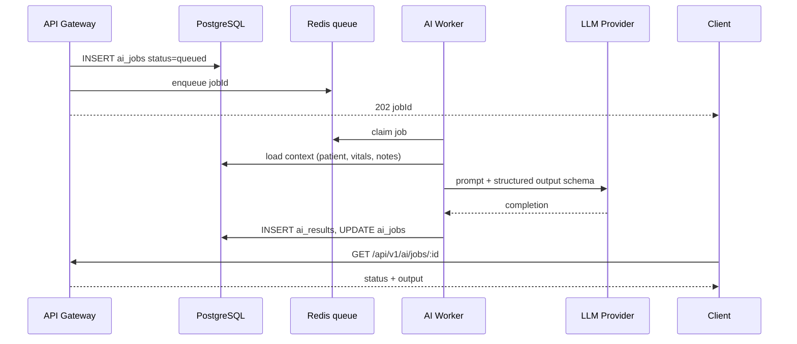

# 5 — AI Services Architecture

## Components

| Component | Location | Responsibility |
|-----------|----------|----------------|
| **AI Summary Engine** | `apps/ai-worker` + `packages/domain-ai` | Async summarization, classification, report generation |
| **Sync AI endpoints** | Gateway `/api/v1/ai/*` | Quick stubs, enqueue job, fetch result by id |
| **Rule engines** | Stay in domain packages | Vitals, medication, escalation (existing — not LLM) |
| **Python posture / OT** | `python-ai/` | Computer vision / specialized; call via HTTP internal |

## Separation: rules vs LLM

```
Domain service (nursing)
  ├── rule-based: vitals analyze, medication alert  → immediate response
  └── LLM-needed: handover narrative, family message polish → ai_jobs queue
```

Do not block clinical HTTP requests on LLM latency; return `202 Accepted` + `jobId` when async.

## AI job kinds (extend existing enum)

From `postgresql.sql` `ai_job_kind`:

| Kind | Trigger | Output |
|------|---------|--------|
| `patient_summary` | Doctor opens chart | Text summary |
| `clinical_notes_summary` | End of shift | Handover blob |
| `lead_classify` | New CRM lead | Tags + priority |
| `follow_up_message` | CRM scheduler | Draft WhatsApp text |
| `nursing_alert_summary` | High alert | Concise alert text |
| `rehab_progress_report` | Weekly review | Progress paragraph |
| `command_center_brief` | Dashboard refresh | Facility brief |

Add kinds via migration, not ad-hoc strings.

## AI worker flow



## Package layout: `domain-ai`

```
packages/domain-ai/src/
├── ai.routes.ts              # thin HTTP
├── ai.controller.ts
├── ai.service.ts             # enqueue, getResult
├── ai.repository.ts
├── prompts/                  # versioned templates
│   ├── handover.v1.ts
│   └── lead-classify.v1.ts
├── providers/
│   ├── llm.interface.ts
│   ├── openai.provider.ts
│   └── stub.provider.ts      # dev / tests
└── context-builders/         # per kind: assemble prompt input
    ├── patient-summary.context.ts
    └── rehab-progress.context.ts
```

## Prompt & safety

- **PII minimization** — send only fields required for the task; log redacted prompts in dev.
- **Structured output** — JSON schema or Zod validation on LLM response; retry once on parse failure.
- **Version prompts** — `handover.v1` → `v2` without breaking stored `meta.promptVersion` on `ai_results`.
- **Human-in-the-loop** — family messages and CRM outbound drafts stay `draft` until staff approves (CRM UI).

## Provider configuration

| Env | Purpose |
|-----|---------|
| `WMC_AI_PROVIDER` | `openai` \| `azure` \| `stub` |
| `WMC_AI_API_KEY` | Provider secret |
| `WMC_AI_MODEL_DEFAULT` | e.g. `gpt-4o-mini` |
| `WMC_AI_MAX_TOKENS` | cap |
| `WMC_AI_TIMEOUT_MS` | worker timeout |

## Integration with domain modules

Nursing `handover.service.ts`:

```typescript
// Pseudocode
async function generateHandoverSummary(input) {
  if (config.aiMode === 'sync-stub') return stubSummary(input)
  return aiService.enqueue('clinical_notes_summary', { input })
}
```

Store pointer on domain row: `handover.ai_result_id` FK optional.

## Python services

`python-ai/nursing-posture-ai` remains separate:

- Gateway or nursing domain calls `POST http://posture-ai:5000/analyze` with service token.
- Results land in nursing tables; optional secondary `ai_jobs` for natural-language explanation.

## Observability

- Log `jobId`, `kind`, `durationMs`, `tokenUsage` (no raw PHI)
- Metrics: queue depth, failure rate, p95 latency per `kind`
- Dead letter queue for failed jobs after N retries

## Caching

- Cache read-only summaries: `ai_results` + `If-None-Match` on GET
- Invalidate on new clinical data via `sourceUpdatedAt` comparison in `meta` jsonb
