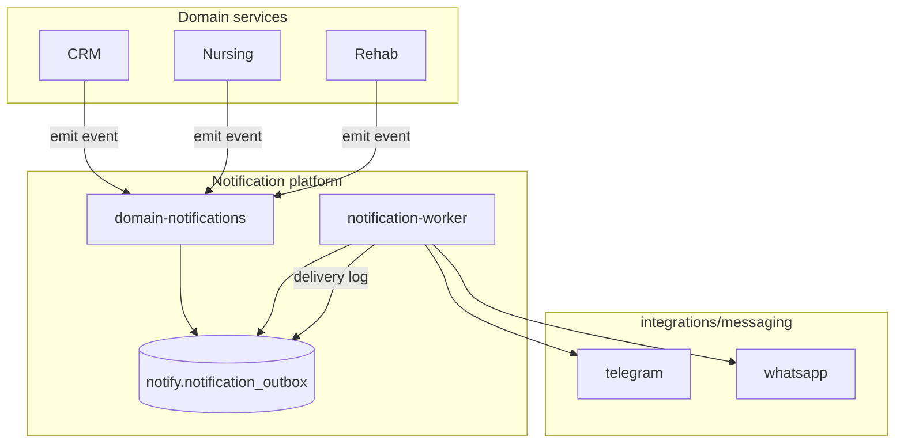

# 6 — Notification System

## Scope

Deliver messages across **Telegram**, **WhatsApp**, and future channels (email/SMS). Handles:

- CRM lead follow-ups and appointment reminders
- Nursing family updates and alert escalations
- Rehab session reminders
- Dashboard-driven broadcast announcements (supervisor)

## Architecture



## Core patterns

### Outbox (transactional)

1. Domain service completes DB transaction (e.g. create `nursing_alert`).
2. Same transaction inserts `notify.notification_outbox` row.
3. Worker polls or listens via Redis queue; marks `processing` → `sent` / `failed`.
4. **Idempotency:** `idempotency_key` = `{source}:{sourceId}:{template_key}`.

### Template registry

`packages/domain-notifications/src/templates/`

| template_key | Channel | Variables |
|--------------|---------|-----------|
| `family_update` | whatsapp, telegram | patientName, message, nurseName |
| `lead_followup` | whatsapp | leadName, appointmentTime |
| `high_alert_escalation` | telegram | patientName, severity, summary |
| `rehab_reminder` | whatsapp | patientName, sessionTime |

Render in worker; keep templates versioned.

## Package structure

```
packages/domain-notifications/src/
├── notifications.service.ts    # enqueue, cancel, status
├── notifications.repository.ts
├── templates/
├── events/                     # map domain events → templates
│   ├── on-nursing-alert.ts
│   └── on-crm-followup-due.ts
└── types.ts

apps/notification-worker/src/
├── worker.ts
├── processors/
│   ├── telegram.processor.ts
│   └── whatsapp.processor.ts
└── scheduler.ts                # cron: due follow-ups
```

## Webhook ingress (inbound)

| Path | Handler |
|------|---------|
| `POST /webhooks/telegram` | Parse update → command router → CRM/nursing handlers |
| `POST /webhooks/whatsapp` | Meta webhook verify + message routing |

Inbound flow:

1. Verify signature
2. Resolve `channel_bindings` → `user_id` or `lead_id`
3. Dispatch to domain command (e.g. "book appointment", "ack alert")
4. Reply via outbound outbox (same worker)

Migrate logic from `wmc-ai-nursing-coordinator/src/telegramWebhookServer.js` into `integrations/messaging/telegram` + gateway webhook route.

## WhatsApp (Meta Cloud API)

- Store `WHATSAPP_PHONE_NUMBER_ID`, `WHATSAPP_ACCESS_TOKEN` in env
- Template messages for outbound-initiated (business-initiated category)
- Session messages within 24h customer window
- Map CRM lead phone → E.164 normalized in `core` or `crm`

## Telegram

- Bot token: `TELEGRAM_BOT_TOKEN`
- Secret token for webhook: `TELEGRAM_WEBHOOK_SECRET`
- Dashboard snapshot endpoints remain **read** APIs; Telegram bot pushes use notifications worker

## Retry & failure

| Failure | Action |
|---------|--------|
| 429 rate limit | Exponential backoff |
| Invalid number | Mark failed; surface in CRM UI |
| Provider down | Retry max 5; alert ops channel |

## Admin API

`GET /api/v1/notifications/deliveries?status=failed` — admin only  
`POST /api/v1/notifications/:id/retry` — admin only

## Privacy & compliance

- Log message **metadata** (channel, template, status), not full body in production logs
- Consent flag on patient/contact: `allow_whatsapp`, `allow_telegram`
- Quiet hours per facility config in `shared-resources/config`

## Dashboard tie-in

Supervisor announcements:

1. `POST /api/v1/nursing/announcements` (existing module pattern)
2. Enqueue `broadcast_announcement` template to bound channels
3. Dashboard polls delivery stats via `GET /api/v1/dashboard/announcement-status`
