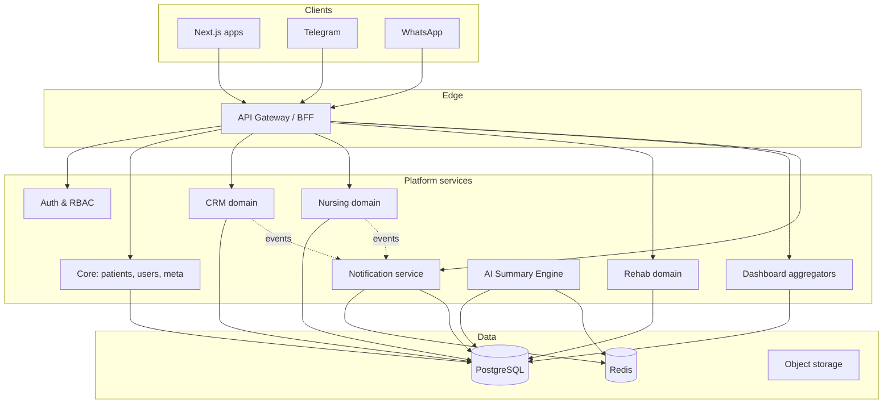

# WMC AI Central Backend — Architecture Index

Planning documents for unifying **Nursing**, **Rehabilitation**, **CRM**, **Dashboard**, **Database**, **Messaging (Telegram / WhatsApp)**, and the **AI Summary Engine** behind one platform boundary.

**Status:** Planning only — no implementation in this folder.

## Current baseline (repo)

| Area | Location today |
|------|----------------|
| Modular Express API (reference) | `wmc-ai-nursing/wmc-ai-nursing-coordinator/wmc-ai-backend/` |
| Target PostgreSQL schema | `wmc-ai-backend/docs/schema/postgresql.sql` |
| CRM service | `wmc-ai-crm/wmc-ai-crm/` |
| Domain Next.js apps | `wmc-ai-*/web` (pnpm workspace) |
| Shared UI | `shared-resources/ui` |
| Integrations stubs | `integrations/` |
| SQL / migrations home | `databases/` |

The central backend **extracts and generalizes** patterns already proven in `wmc-ai-backend`, rather than replacing working domain logic on day one.

## Target topology



## Document map

| # | Topic | File |
|---|--------|------|
| 1 | Folder architecture & tree | [01-folder-structure.md](./01-folder-structure.md) |
| 2 | API gateway | [02-api-gateway.md](./02-api-gateway.md) |
| 3 | Shared database | [03-database.md](./03-database.md) |
| 4 | Shared authentication | [04-authentication.md](./04-authentication.md) |
| 5 | AI services | [05-ai-services.md](./05-ai-services.md) |
| 6 | Notifications (Telegram / WhatsApp) | [06-notifications.md](./06-notifications.md) |
| 7 | Dashboard backend | [07-dashboard-backend.md](./07-dashboard-backend.md) |
| 8 | Inter-service communication | [08-inter-service-communication.md](./08-inter-service-communication.md) |
| 9 | Node / Express / Postgres / env conventions | [09-platform-conventions.md](./09-platform-conventions.md) |
| 10 | Implementation phases | [10-implementation-phases.md](./10-implementation-phases.md) |

## Architectural principles

1. **Modular monolith first** — one deployable API with strict domain modules; split workers (AI, notifications) only when load or team boundaries require it.
2. **API-first** — every domain exposes versioned REST under `/api/v1`; Next.js apps call the gateway, not domain databases directly.
3. **Single source of truth for identity and patients** — `core` schema; domains reference `patient_id` / `user_id`, no duplicate master records.
4. **Outbox for side effects** — nursing alerts, CRM follow-ups, and handovers enqueue notification/AI jobs reliably.
5. **Incremental migration** — keep `wmc-ai-backend` running; move modules and routes behind the gateway per phase (see doc 10).

## Quick folder tree (target)

See full tree in [01-folder-structure.md](./01-folder-structure.md). Abbreviated:

```
wmc-ai-platform/
├── apps/
│   ├── api-gateway/          # Express entry, routing, BFF
│   ├── notification-worker/
│   └── ai-worker/
├── packages/
│   ├── shared-auth/
│   ├── shared-db/
│   ├── shared-types/
│   ├── shared-utils/
│   └── domain-*/               # nursing | rehab | crm
├── integrations/             # symlink or import from repo root
└── config/
```

## Related repo docs

- [Enterprise architecture](../../enterprise-architecture.md) — ecosystem-wide boundaries
- [wmc-ai-backend ARCHITECTURE](../../../wmc-ai-nursing/wmc-ai-nursing-coordinator/wmc-ai-backend/docs/ARCHITECTURE.md) — existing module layout
