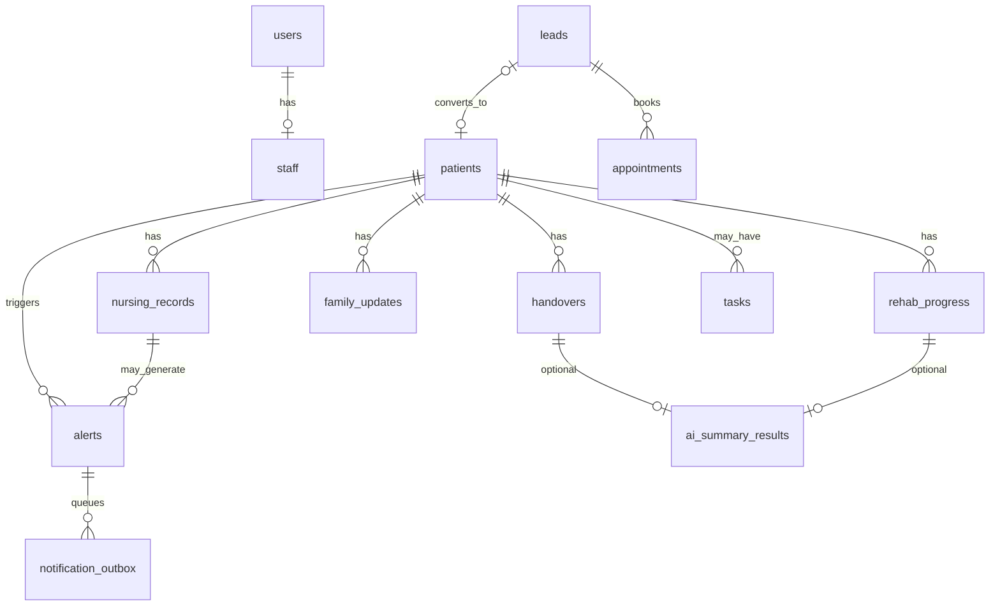
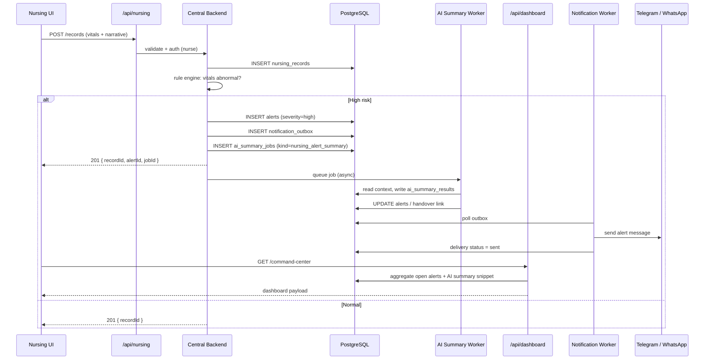
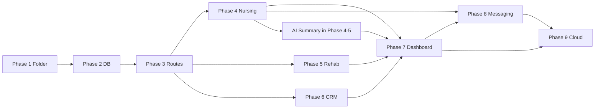

# WMC AI Central Backend — Blueprint

**Location:** `D:\WMC-AI\wmc-ai-central-backend`  
**Status:** Architecture plan only — **no implementation code yet**  
**Version:** 1.0 · 2026-05-20

---

## Purpose

Connect these systems through one **Central Backend** and one **shared PostgreSQL database**:

| System | Role |
|--------|------|
| **WMC AI Nursing** | Clinical records, vitals, handovers, alerts |
| **WMC AI Rehabilitation** | Sessions, progress, therapy goals |
| **WMC AI CRM** | Leads, appointments, follow-ups |
| **Central Backend** | API gateway, orchestration, auth, persistence |
| **Database** | Single source of truth (PostgreSQL) |
| **Dashboard** | Aggregated read APIs for all UIs |
| **Telegram / WhatsApp** | Outbound alerts + inbound webhooks |
| **AI Summary Engine** | Async summaries after clinical/CRM events |

**Related planning (detail):** `docs/architecture/central-backend/`  
**Reference implementation today:** `wmc-ai-nursing/.../wmc-ai-backend/`

---

## 1. Recommended folder structure

Root: **`D:\WMC-AI\wmc-ai-central-backend`**

```
wmc-ai-central-backend/
├── CENTRAL-BACKEND-BLUEPRINT.md          # this file
├── README.md                             # quick start (when coding begins)
├── package.json                          # pnpm workspace root (phase 1)
├── pnpm-workspace.yaml
├── tsconfig.base.json
├── .env.example
│
├── apps/
│   ├── api/                              # Main Express API (gateway + domains)
│   │   ├── src/
│   │   │   ├── app.ts
│   │   │   ├── server.ts
│   │   │   ├── config/
│   │   │   │   └── env.ts
│   │   │   ├── middleware/
│   │   │   │   ├── auth.middleware.ts
│   │   │   │   ├── error.middleware.ts
│   │   │   │   └── request-id.middleware.ts
│   │   │   └── routes/
│   │   │       └── index.ts              # mounts /api/*
│   │   └── package.json
│   │
│   ├── notification-worker/              # Telegram / WhatsApp delivery (phase 8)
│   │   └── src/
│   │       ├── worker.ts
│   │       └── processors/
│   │
│   └── ai-summary-worker/                # AI Summary Engine jobs (phase 4+)
│       └── src/
│           ├── worker.ts
│           ├── jobs/
│           └── providers/
│
├── packages/
│   ├── shared-auth/                      # JWT, RBAC, login
│   ├── shared-db/                          # pool, migrations client
│   ├── shared-types/                       # DTOs shared with frontends
│   └── shared-utils/                       # logger, errors, validation
│
├── modules/                              # API domain modules (mirror /api paths)
│   ├── auth/
│   │   ├── auth.routes.ts
│   │   ├── auth.controller.ts
│   │   ├── auth.service.ts
│   │   └── auth.repository.ts
│   ├── nursing/
│   ├── rehab/
│   ├── crm/
│   ├── dashboard/
│   ├── notifications/
│   ├── ai-summary/
│   └── database/                         # ops: health, schema version, sync status
│
├── integrations/                         # thin adapters (or symlink to repo root)
│   ├── telegram/
│   └── whatsapp/
│
├── database/
│   ├── migrations/                       # numbered SQL (phase 2)
│   ├── seeds/
│   └── schema/
│       └── central-schema.sql            # blueprint DDL reference
│
├── docs/
│   ├── api-contracts.md
│   └── flows/
│       └── nurse-record-to-alert.md
│
└── deployments/
    ├── docker/
    │   └── docker-compose.yml
    └── cloud/                            # phase 9 — K8s / Terraform stubs
```

### Repo-level companions (unchanged)

| Path | Use |
|------|-----|
| `D:\WMC-AI\databases\` | Optional mirror / CI migration runner |
| `D:\WMC-AI\integrations\` | Shared Telegram/WhatsApp adapters |
| `D:\WMC-AI\wmc-ai-nursing\` | Nursing UI + legacy backend (migrate in phase 4) |
| `D:\WMC-AI\wmc-ai-rehabilitation\` | Rehab UI (phase 5) |
| `D:\WMC-AI\wmc-ai-crm\` | CRM app (phase 6) |

---

## 2. API module structure

**Base URL:** `https://<central-host>/api`  
**Versioning (recommended):** prefix `v1` → `/api/v1/nursing` when implementing; below uses your requested paths under `/api`.

### Route map

| Mount | Module folder | Responsibility |
|-------|---------------|----------------|
| `/api/auth` | `modules/auth/` | Login, refresh, `/me`, roles |
| `/api/nursing` | `modules/nursing/` | Records, vitals, handovers, family updates, nursing tasks |
| `/api/rehab` | `modules/rehab/` | Sessions, rehab progress, therapy tasks |
| `/api/crm` | `modules/crm/` | Leads, appointments, pipeline |
| `/api/dashboard` | `modules/dashboard/` | BFF: command center, rollups, widgets |
| `/api/notifications` | `modules/notifications/` | Outbox status, templates, webhook ingress config |
| `/api/ai-summary` | `modules/ai-summary/` | Enqueue jobs, poll results, list by patient/lead |
| `/api/database` | `modules/database/` | **Ops only** — not raw SQL (see below) |

**Public health (no auth):**

- `GET /health` — liveness  
- `GET /ready` — DB + Redis connectivity  

**Webhooks (separate from `/api`, provider auth):**

- `POST /webhooks/telegram`
- `POST /webhooks/whatsapp`

### `/api/database` — intended scope

This is **not** a generic SQL API. It exposes **platform data layer operations** for admins and integrations:

| Method | Path | Purpose |
|--------|------|---------|
| GET | `/api/database/health` | Connection pool status |
| GET | `/api/database/schema-version` | Applied migration version |
| GET | `/api/database/sync-status` | Legacy SheetDb → Postgres sync state (migration period) |
| POST | `/api/database/migrate` | Admin-only trigger migrations (prod: CI only) |

### Example endpoint breakdown

#### `/api/auth`

- `POST /login`
- `POST /refresh`
- `GET /me`
- `POST /logout`

#### `/api/nursing`

- `GET|POST /records` — nursing_records
- `GET|POST /alerts`
- `GET|POST /handovers`
- `GET|POST /family-updates`
- `GET|POST /tasks`
- `POST /vitals` (subset of records)

#### `/api/rehab`

- `GET|POST /progress` — rehab_progress
- `GET|POST /sessions`
- `GET|POST /tasks`

#### `/api/crm`

- `GET|POST /leads`
- `GET|PATCH /leads/:id`
- `GET|POST /appointments`

#### `/api/dashboard`

- `GET /command-center`
- `GET /nursing-summary`
- `GET /rehab-summary`
- `GET /crm-pipeline`
- `GET /alerts/active`
- `GET /telegram-snapshot`

#### `/api/notifications`

- `GET /deliveries`
- `POST /deliveries/:id/retry`
- `GET /channels` — bound Telegram/WhatsApp IDs

#### `/api/ai-summary`

- `POST /jobs` — enqueue (kind, source ref)
- `GET /jobs/:id`
- `GET /results?patientId=&kind=`

### Internal module pattern (per domain)

```
modules/<domain>/
├── <domain>.routes.ts      # Express router
├── <domain>.controller.ts  # HTTP in/out
├── <domain>.service.ts     # business rules, emit events
├── <domain>.repository.ts  # SQL only
├── <domain>.validation.ts  # Zod schemas
└── <domain>.types.ts
```

---

## 3. Shared database design

**Engine:** PostgreSQL  
**Migrations:** `wmc-ai-central-backend/database/migrations/` (canonical) + optional sync to `D:\WMC-AI\databases\migrations\`

### Schema layout

| PostgreSQL schema | Tables |
|-------------------|--------|
| `core` | `users`, `staff`, `patients` |
| `nursing` | `nursing_records`, `alerts`, `handovers`, `family_updates` |
| `rehab` | `rehab_progress` |
| `crm` | `leads`, `appointments` |
| `shared` | `tasks` (cross-domain) |
| `notify` | `notification_outbox`, `notification_deliveries`, `channel_bindings` |
| `ai` | `ai_summary_jobs`, `ai_summary_results` |

### Entity definitions (blueprint)

#### `core.users`

| Column | Type | Notes |
|--------|------|-------|
| id | UUID PK | |
| email | TEXT UNIQUE | login |
| password_hash | TEXT | bcrypt |
| full_name | TEXT | |
| role | ENUM | admin, doctor, nurse, receptionist, therapist |
| is_active | BOOLEAN | default true |
| created_at, updated_at | TIMESTAMPTZ | |

#### `core.staff`

Extends login identity with HR/ops fields. **1:1 with `users`** for staff accounts.

| Column | Type | Notes |
|--------|------|-------|
| id | UUID PK | |
| user_id | UUID FK → users UNIQUE | |
| employee_code | TEXT UNIQUE | |
| department | TEXT | nursing, rehab, frontdesk, admin |
| shift_group | TEXT | optional |
| phone | TEXT | |
| telegram_chat_id | TEXT | nullable |
| whatsapp_number | TEXT | E.164 |
| created_at, updated_at | TIMESTAMPTZ | |

#### `core.patients`

| Column | Type | Notes |
|--------|------|-------|
| id | UUID PK | |
| mrn | TEXT UNIQUE | medical record number |
| full_name | TEXT | |
| date_of_birth | DATE | |
| gender | TEXT | |
| phone | TEXT | |
| medical_summary | TEXT | |
| consent_whatsapp | BOOLEAN | |
| consent_telegram | BOOLEAN | |
| deleted_at | TIMESTAMPTZ | soft delete |
| created_at, updated_at | TIMESTAMPTZ | |

#### `nursing.nursing_records`

Daily/shift clinical documentation (generalizes vitals + narrative).

| Column | Type | Notes |
|--------|------|-------|
| id | UUID PK | |
| patient_id | UUID FK → patients | |
| recorded_by_staff_id | UUID FK → staff | |
| shift_date | DATE | |
| record_type | ENUM | daily_report, vitals, medication, wound, other |
| narrative | TEXT | |
| vitals_json | JSONB | temp, BP, HR, SpO2 when type=vitals |
| created_at | TIMESTAMPTZ | |

#### `nursing.alerts`

| Column | Type | Notes |
|--------|------|-------|
| id | UUID PK | |
| patient_id | UUID FK | |
| severity | ENUM | low, medium, high, critical |
| category | TEXT | vitals, medication, fall, etc. |
| description | TEXT | |
| source_record_id | UUID FK → nursing_records | nullable |
| status | ENUM | open, acknowledged, resolved |
| acknowledged_by_staff_id | UUID FK | nullable |
| notify_sent_at | TIMESTAMPTZ | nullable |
| created_at | TIMESTAMPTZ | |

#### `nursing.handovers`

| Column | Type | Notes |
|--------|------|-------|
| id | UUID PK | |
| patient_id | UUID FK | |
| from_staff_id | UUID FK → staff | |
| to_staff_id | UUID FK → staff | nullable |
| shift_date | DATE | |
| content | TEXT | |
| ai_summary_result_id | UUID FK → ai.ai_summary_results | nullable |
| created_at | TIMESTAMPTZ | |

#### `nursing.family_updates`

| Column | Type | Notes |
|--------|------|-------|
| id | UUID PK | |
| patient_id | UUID FK | |
| created_by_staff_id | UUID FK | |
| message | TEXT | |
| channel | ENUM | whatsapp, telegram, internal |
| delivery_status | ENUM | draft, queued, sent, failed |
| created_at | TIMESTAMPTZ | |

#### `rehab.rehab_progress`

| Column | Type | Notes |
|--------|------|-------|
| id | UUID PK | |
| patient_id | UUID FK | |
| therapist_staff_id | UUID FK → staff | |
| session_at | TIMESTAMPTZ | |
| pain_score | INT 0–10 | |
| mobility_notes | TEXT | |
| goals_met_json | JSONB | |
| ai_summary_result_id | UUID FK | nullable |
| created_at, updated_at | TIMESTAMPTZ | |

#### `crm.leads`

| Column | Type | Notes |
|--------|------|-------|
| id | UUID PK | |
| source | ENUM | whatsapp, google_form, walk_in, referral, other |
| status | ENUM | new, contacted, qualified, converted, lost |
| pipeline_stage | ENUM | inquiry … closed_lost |
| contact_name | TEXT | |
| phone, email | TEXT | |
| notes | TEXT | |
| follow_up_at | TIMESTAMPTZ | |
| converted_patient_id | UUID FK → patients | nullable |
| created_at, updated_at | TIMESTAMPTZ | |

#### `crm.appointments`

| Column | Type | Notes |
|--------|------|-------|
| id | UUID PK | |
| lead_id | UUID FK → leads | nullable |
| patient_id | UUID FK → patients | nullable |
| scheduled_at | TIMESTAMPTZ | |
| duration_minutes | INT | |
| status | ENUM | scheduled, confirmed, completed, cancelled, no_show |
| assigned_staff_id | UUID FK → staff | nullable |
| notes | TEXT | |
| created_at, updated_at | TIMESTAMPTZ | |

#### `shared.tasks`

Cross-domain work items (nursing reminders, rehab homework, CRM callbacks).

| Column | Type | Notes |
|--------|------|-------|
| id | UUID PK | |
| domain | ENUM | nursing, rehab, crm |
| patient_id | UUID FK | nullable |
| lead_id | UUID FK | nullable |
| assigned_to_staff_id | UUID FK → staff | |
| title | TEXT | |
| due_at | TIMESTAMPTZ | |
| status | ENUM | pending, in_progress, done, cancelled |
| priority | ENUM | low, normal, high |
| created_at, updated_at | TIMESTAMPTZ | |

### Relationships (diagram)



### Index strategy (summary)

- `patients(mrn)`, `leads(status, follow_up_at)`, `alerts(patient_id, status, severity)`
- `nursing_records(patient_id, shift_date DESC)`
- `tasks(assigned_to_staff_id, due_at) WHERE status = 'pending'`
- `notification_outbox(status) WHERE status = 'pending'`

---

## 4. Central Backend responsibilities

| # | Responsibility | How |
|---|----------------|-----|
| 1 | **Receive data** from Nursing, Rehab, CRM | REST `/api/nursing`, `/api/rehab`, `/api/crm` — JWT auth, validated DTOs |
| 2 | **Store in central database** | Repository layer → PostgreSQL; transactional writes |
| 3 | **Generate AI summary** | On events (handover, high alert, rehab session end) → enqueue `ai_summary_jobs` → worker writes `ai_summary_results` |
| 4 | **Send alerts** to Telegram / WhatsApp | On `alerts.severity >= high` or explicit family update → `notification_outbox` → worker |
| 5 | **Provide dashboard data** | `/api/dashboard/*` composes nursing + rehab + CRM + open alerts |

### What Central Backend does **not** do

- Replace domain UIs (Next.js apps keep UX)
- Expose raw SQL to clients
- Block HTTP on LLM latency (AI is async)
- Own computer-vision posture logic (stays in `python-ai/`; optional HTTP call)

### Auth & roles

Same RBAC as existing backend: `admin`, `doctor`, `nurse`, `receptionist`, `therapist`.  
Nursing apps use nurse/doctor; CRM uses receptionist/admin; Rehab uses therapist.

---

## 5. System flow example

**Scenario:** Nurse enters record → high-risk vitals → AI summary → dashboard → Telegram/WhatsApp alert.



### Step-by-step (plain language)

1. Nurse submits vitals in **WMC AI Nursing** UI.
2. UI calls **Central Backend** `POST /api/nursing/records` (not local DB directly).
3. Central Backend saves **`nursing_records`**, runs rules, may create **`alerts`**.
4. If high risk: enqueue **AI Summary** job and **notification** outbox row in same DB transaction.
5. **AI Summary Worker** generates concise text → **`ai_summary_results`**.
6. **Dashboard** `GET /api/dashboard/command-center` shows patient on critical list + AI snippet.
7. **Notification Worker** sends Telegram/WhatsApp to supervisor channel and/or family (per consent).

---

## 6. Implementation phases

| Phase | Name | Deliverables | Exit criteria |
|-------|------|--------------|---------------|
| **1** | Folder structure | `wmc-ai-central-backend/` tree, workspace config, `.env.example`, docs stubs | Repo folder matches section 1; `pnpm` workspace resolves |
| **2** | Shared database schema | `database/migrations/001_*.sql`, `central-schema.sql`, seeds | Migrations apply on empty Postgres; all 11 table groups exist |
| **3** | API gateway routes | `apps/api` with routers mounted: auth, nursing, rehab, crm, dashboard, notifications, ai-summary, database | `GET /health` + stub handlers return 501 or mock JSON per route group |
| **4** | Connect Nursing | Proxy/migrate from `wmc-ai-backend` modules; Nursing UI `API_URL` → central | Create record + alert path works end-to-end |
| **5** | Connect Rehab | Rehab UI/API → `/api/rehab` | `rehab_progress` CRUD via central DB |
| **6** | Connect CRM | `wmc-ai-crm` → `/api/crm` | Leads + appointments in central DB |
| **7** | Dashboard summary | `/api/dashboard/command-center`, snapshots, role widgets | Dashboard apps read only central API |
| **8** | Telegram / WhatsApp | `notification-worker`, webhooks, outbox, family_updates delivery | High alert triggers real message in staging |
| **9** | Deploy to cloud | Docker images, `deployments/cloud`, env secrets, HTTPS, CI migrate | Staging URL stable; monitoring on `/health` |

### Phase dependencies



### Phase 9 — cloud deployment (planning targets)

| Item | Recommendation |
|------|----------------|
| Compute | Container per `apps/api`, workers scale separately |
| Database | Managed PostgreSQL (RDS / Cloud SQL) |
| Cache/queue | Managed Redis |
| Secrets | Vault / platform secret manager — never in git |
| Ingress | HTTPS load balancer → API; webhook paths routed to same service |
| CI | Migrate on deploy; smoke test `/health` + `/api/auth/login` |

---

## Integration matrix

| Source system | Central API | Primary tables |
|---------------|-------------|----------------|
| WMC AI Nursing | `/api/nursing` | nursing_records, alerts, handovers, family_updates, tasks |
| WMC AI Rehabilitation | `/api/rehab` | rehab_progress, tasks |
| WMC AI CRM | `/api/crm` | leads, appointments, tasks |
| Dashboard (all UIs) | `/api/dashboard` | reads across schemas |
| Telegram / WhatsApp | `/webhooks/*` + worker | notify.*, channel_bindings |
| AI Summary Engine | `/api/ai-summary` + worker | ai.* |

---

## Document control

| Field | Value |
|-------|-------|
| Owner | WMC AI Platform |
| Next action | Phase 1 — create folder tree and workspace files (when approved) |
| Code policy | **No application code until phase 1 is explicitly started** |

*End of blueprint.*
