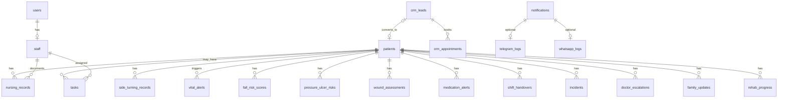

# WMC AI Central Backend — Database Schema Blueprint

**Location:** `D:\WMC-AI\wmc-ai-central-backend`  
**Status:** Planning only — **no migrations or database implementation yet**  
**Version:** 1.0 · 2026-05-20  
**Engine:** PostgreSQL 15+ (recommended)

**Related:**

- [CENTRAL-BACKEND-BLUEPRINT.md](./CENTRAL-BACKEND-BLUEPRINT.md)
- [NOTIFICATION-INTEGRATION-BLUEPRINT.md](./NOTIFICATION-INTEGRATION-BLUEPRINT.md)
- Reference SQL: `wmc-ai-nursing/.../wmc-ai-backend/docs/schema/postgresql.sql`
- Migrations home (future): `D:\WMC-AI\databases\migrations\`

---

## Overview

One PostgreSQL cluster with **logical schemas** (bounded contexts). All clinical rows reference **`core.patients`**. Staff actions reference **`core.staff`** (linked to **`core.users`**).

| Schema | Tables in this blueprint |
|--------|--------------------------|
| `core` | `users`, `staff`, `patients` |
| `nursing` | clinical + ops (records, alerts, handovers, tasks, …) |
| `crm` | `crm_leads`, `crm_appointments` |
| `rehab` | `rehab_progress` |
| `notify` | `notifications`, `telegram_logs`, `whatsapp_logs` |

---

## Global conventions

| Convention | Rule |
|------------|------|
| **Primary keys** | `id UUID` — `uuid_generate_v4()` |
| **patientId** | Column `patient_id UUID NOT NULL` → `core.patients(id)` |
| **staffId** | Column `staff_id UUID` → `core.staff(id)`; auth actions may also store `user_id` → `core.users(id)` |
| **Timestamps** | `created_at TIMESTAMPTZ NOT NULL DEFAULT now()`; `updated_at TIMESTAMPTZ NOT NULL DEFAULT now()` on mutable tables |
| **Soft delete** | `deleted_at TIMESTAMPTZ` nullable on `patients` only (phase 1) |
| **Status** | Postgres `ENUM` or `TEXT` + check constraint; always indexed when used in queues |
| **Priority** | Shared enum where possible: `low`, `medium`, `high`, `urgent`, `critical` |
| **Audit** | `created_by_staff_id`, `updated_by_staff_id` optional on write-heavy tables |

### Shared enums (suggested)

```sql
CREATE TYPE user_role AS ENUM ('admin', 'doctor', 'nurse', 'receptionist', 'therapist');
CREATE TYPE priority_level AS ENUM ('low', 'medium', 'high', 'urgent', 'critical');
CREATE TYPE alert_severity AS ENUM ('low', 'medium', 'high', 'critical');
CREATE TYPE record_status AS ENUM ('draft', 'active', 'archived', 'cancelled');
CREATE TYPE task_status AS ENUM ('pending', 'in_progress', 'done', 'cancelled');
CREATE TYPE notification_status AS ENUM ('queued', 'sent', 'failed', 'mock_sent');
```

---

## Entity relationship (summary)



---

## 1. `core.patients`

**Purpose:** Single master record for every person receiving care.

| Field | Type | Notes |
|-------|------|-------|
| `id` | UUID PK | |
| `mrn` | TEXT UNIQUE | Medical record number |
| `full_name` | TEXT NOT NULL | |
| `date_of_birth` | DATE | |
| `gender` | TEXT | |
| `phone` | TEXT | E.164 preferred |
| `email` | TEXT | |
| `medical_summary` | TEXT | |
| `consent_whatsapp` | BOOLEAN DEFAULT false | Family messaging |
| `consent_telegram` | BOOLEAN DEFAULT false | |
| `status` | TEXT / ENUM | `active`, `discharged`, `deceased` |
| `created_at` | TIMESTAMPTZ | |
| `updated_at` | TIMESTAMPTZ | |
| `deleted_at` | TIMESTAMPTZ | Soft delete |

**Relationships:** Parent of almost all clinical tables via `patient_id`.

---

## 2. `core.staff`

**Purpose:** Operational identity for nurses, doctors, therapists, supervisors (HR + contact channels).

| Field | Type | Notes |
|-------|------|-------|
| `id` | UUID PK | |
| `user_id` | UUID UNIQUE FK → `users.id` | Login account (nullable for system bots) |
| `employee_code` | TEXT UNIQUE | |
| `full_name` | TEXT NOT NULL | Denormalized for reports |
| `department` | TEXT | `nursing`, `rehab`, `crm`, `admin` |
| `role_title` | TEXT | Display title |
| `phone` | TEXT | |
| `telegram_chat_id` | TEXT | Bot binding |
| `whatsapp_number` | TEXT | Supervisor alerts |
| `status` | TEXT | `active`, `on_leave`, `inactive` |
| `created_at` | TIMESTAMPTZ | |
| `updated_at` | TIMESTAMPTZ | |

**Relationships:** Referenced by `staff_id` on records, tasks, handovers, acknowledgements.

---

## 3. `core.users`

**Purpose:** Authentication and RBAC (login credentials).

| Field | Type | Notes |
|-------|------|-------|
| `id` | UUID PK | |
| `email` | TEXT UNIQUE NOT NULL | |
| `password_hash` | TEXT NOT NULL | bcrypt |
| `full_name` | TEXT NOT NULL | |
| `role` | user_role ENUM | admin, doctor, nurse, … |
| `is_active` | BOOLEAN DEFAULT true | |
| `last_login_at` | TIMESTAMPTZ | |
| `created_at` | TIMESTAMPTZ | |
| `updated_at` | TIMESTAMPTZ | |

**Relationships:** 1:1 with `staff` when staff member; referenced by legacy `user_id` fields if needed.

---

## 4. `nursing.nursing_records`

**Purpose:** Structured shift clinical assessments (vitals, narrative, mobility, mood) — maps to nursing backend `/nursing/records`.

| Field | Type | Notes |
|-------|------|-------|
| `id` | UUID PK | |
| `patient_id` | UUID FK → patients | Required |
| `staff_id` | UUID FK → staff | Nurse who recorded |
| `shift_date` | DATE NOT NULL | |
| `record_type` | TEXT | `daily_report`, `vitals`, `assessment` |
| `blood_pressure` | TEXT | e.g. `120/80` |
| `pulse` | INT | |
| `temperature` | REAL | |
| `oxygen` | TEXT | SpO2 |
| `pain_score` | INT | 0–10 |
| `mobility` | TEXT | |
| `mood` | TEXT | |
| `side_turning` | TEXT | Status cue |
| `wound_condition` | TEXT | |
| `appetite` | TEXT | |
| `notes` | TEXT | |
| `status` | record_status | Default `active` |
| `created_at` | TIMESTAMPTZ | |
| `updated_at` | TIMESTAMPTZ | |

**Relationships:** `patient_id`, `staff_id`; may spawn `vital_alerts`, risk scores.

---

## 5. `nursing.side_turning_records`

**Purpose:** Side-turning compliance log and next due time.

| Field | Type | Notes |
|-------|------|-------|
| `id` | UUID PK | |
| `patient_id` | UUID FK | |
| `staff_id` | UUID FK | Who performed / logged |
| `turned_at` | TIMESTAMPTZ | |
| `position` | TEXT | `left`, `right`, `back` |
| `next_turning_time` | TIMESTAMPTZ | |
| `photo_required` | BOOLEAN | |
| `photo_uploaded` | BOOLEAN | |
| `photo_url` | TEXT | Placeholder / S3 path |
| `status` | TEXT | `completed`, `pending`, `overdue` |
| `priority` | priority_level | Escalation hint |
| `created_at` | TIMESTAMPTZ | |
| `updated_at` | TIMESTAMPTZ | |

**Relationships:** `patient_id`, `staff_id`; feeds `pressure_ulcer_risks`, `tasks`.

---

## 6. `nursing.vital_alerts`

**Purpose:** Rule-based abnormal vitals alerts (`/vitals/analyze`).

| Field | Type | Notes |
|-------|------|-------|
| `id` | UUID PK | |
| `patient_id` | UUID FK | |
| `nursing_record_id` | UUID FK → nursing_records | Source row |
| `staff_id` | UUID FK | Reporter |
| `severity` | alert_severity | |
| `alert_level` | TEXT | `Low`, `Medium`, `High` |
| `category` | TEXT | `vitals` |
| `description` | TEXT | |
| `vitals_snapshot` | JSONB | BP, HR, temp, SpO2 at alert time |
| `status` | TEXT | `open`, `acknowledged`, `resolved` |
| `priority` | priority_level | |
| `acknowledged_by_staff_id` | UUID FK → staff | |
| `acknowledged_at` | TIMESTAMPTZ | |
| `created_at` | TIMESTAMPTZ | |
| `updated_at` | TIMESTAMPTZ | |

**Relationships:** `patient_id`; may link `doctor_escalations`, `notifications`.

---

## 7. `nursing.fall_risk_scores`

**Purpose:** Fall risk assessment results (`/risk/fall-score`).

| Field | Type | Notes |
|-------|------|-------|
| `id` | UUID PK | |
| `patient_id` | UUID FK | |
| `staff_id` | UUID FK | Assessor |
| `nursing_record_id` | UUID FK | Optional source |
| `risk_level` | TEXT | `Low`, `Moderate`, `High` |
| `score` | INT | Optional numeric |
| `factors` | JSONB | Rule inputs |
| `recommendations` | JSONB | string[] |
| `status` | record_status | |
| `priority` | priority_level | Derived from risk_level |
| `created_at` | TIMESTAMPTZ | |
| `updated_at` | TIMESTAMPTZ | |

**Relationships:** `patient_id`, `staff_id`.

---

## 8. `nursing.pressure_ulcer_risks`

**Purpose:** Pressure injury / PU risk assessments (`/risk/pressure-ulcer`).

| Field | Type | Notes |
|-------|------|-------|
| `id` | UUID PK | |
| `patient_id` | UUID FK | |
| `staff_id` | UUID FK | |
| `nursing_record_id` | UUID FK | |
| `risk_level` | TEXT | `Low`, `Moderate`, `High` |
| `score` | INT | |
| `factors` | JSONB | bedbound, nutrition, … |
| `recommendations` | JSONB | |
| `status` | record_status | |
| `priority` | priority_level | |
| `created_at` | TIMESTAMPTZ | |
| `updated_at` | TIMESTAMPTZ | |

**Relationships:** `patient_id`; links to `side_turning_records`, `tasks`.

---

## 9. `nursing.wound_assessments`

**Purpose:** Wound monitoring and infection risk (`/wound/assessment`).

| Field | Type | Notes |
|-------|------|-------|
| `id` | UUID PK | |
| `patient_id` | UUID FK | |
| `staff_id` | UUID FK | |
| `wound_site` | TEXT | |
| `wound_stage` | TEXT | |
| `infection_risk` | TEXT | `Low`, `Medium`, `High` |
| `photo_uploaded` | BOOLEAN | |
| `photo_url` | TEXT | |
| `notes` | TEXT | |
| `alerts` | JSONB | Generated alert strings |
| `recommendations` | JSONB | |
| `status` | record_status | |
| `priority` | priority_level | From infection_risk |
| `created_at` | TIMESTAMPTZ | |
| `updated_at` | TIMESTAMPTZ | |

**Relationships:** `patient_id`, `staff_id`.

---

## 10. `nursing.medication_alerts`

**Purpose:** MAR / timing / allergy / BP rule alerts (`/medication/check-alert`).

| Field | Type | Notes |
|-------|------|-------|
| `id` | UUID PK | |
| `patient_id` | UUID FK | |
| `staff_id` | UUID FK | |
| `medication_name` | TEXT | |
| `scheduled_at` | TIMESTAMPTZ | |
| `alert_type` | TEXT | `timing`, `allergy`, `interaction` |
| `severity` | alert_severity | |
| `description` | TEXT | |
| `status` | TEXT | `open`, `acknowledged`, `resolved` |
| `priority` | priority_level | |
| `created_at` | TIMESTAMPTZ | |
| `updated_at` | TIMESTAMPTZ | |

**Relationships:** `patient_id`, `staff_id`; may trigger `notifications`.

---

## 11. `nursing.shift_handovers`

**Purpose:** Shift transition summaries (`/handover/generate`, `/handover/auto-generate`).

| Field | Type | Notes |
|-------|------|-------|
| `id` | UUID PK | |
| `patient_id` | UUID FK | Nullable for facility-wide rollup rows |
| `from_staff_id` | UUID FK → staff | |
| `to_staff_id` | UUID FK → staff | |
| `shift_label` | TEXT | e.g. `Day → Evening` |
| `shift_date` | DATE | |
| `overall_shift_status` | TEXT | `Stable`, `Attention Required`, `Critical` |
| `content` | TEXT | Handover narrative |
| `pending_tasks` | JSONB | string[] |
| `critical_alerts` | JSONB | string[] |
| `ai_summary_id` | UUID | FK → ai_results (future) |
| `prepared_by_ai` | BOOLEAN | |
| `status` | record_status | |
| `priority` | priority_level | From overall_shift_status |
| `created_at` | TIMESTAMPTZ | |
| `updated_at` | TIMESTAMPTZ | |

**Relationships:** `patient_id` (optional), `from_staff_id`, `to_staff_id`; feeds Telegram `/handover`, WhatsApp handover template.

---

## 12. `nursing.incidents`

**Purpose:** Incident / adverse event reports (`/incidents/report`).

| Field | Type | Notes |
|-------|------|-------|
| `id` | UUID PK | |
| `patient_id` | UUID FK | Nullable if facility-wide |
| `reported_by_staff_id` | UUID FK → staff | |
| `incident_type` | TEXT | `fall`, `medication`, `behavior`, … |
| `severity` | alert_severity | |
| `description` | TEXT NOT NULL | |
| `occurred_at` | TIMESTAMPTZ | |
| `status` | TEXT | `reported`, `investigating`, `closed` |
| `priority` | priority_level | |
| `created_at` | TIMESTAMPTZ | |
| `updated_at` | TIMESTAMPTZ | |

**Relationships:** `patient_id`, `reported_by_staff_id`.

---

## 13. `nursing.tasks`

**Purpose:** Cross-cutting work queue (`/tasks/queue`) — nursing, follow-ups, CRM callbacks.

| Field | Type | Notes |
|-------|------|-------|
| `id` | UUID PK | |
| `patient_id` | UUID FK | Nullable |
| `lead_id` | UUID FK → crm_leads | Nullable |
| `assigned_to_staff_id` | UUID FK → staff | |
| `created_by_staff_id` | UUID FK → staff | |
| `domain` | TEXT | `nursing`, `crm`, `rehab` |
| `title` | TEXT NOT NULL | |
| `description` | TEXT | |
| `source` | TEXT | e.g. `Doctor Escalation` |
| `due_at` | TIMESTAMPTZ | |
| `status` | task_status | pending, done, … |
| `priority` | priority_level | Urgent, High, … |
| `created_at` | TIMESTAMPTZ | |
| `updated_at` | TIMESTAMPTZ | |

**Relationships:** `patient_id`, `assigned_to_staff_id`; Telegram `/acknowledge TASK-ID`.

---

## 14. `nursing.reminders`

**Purpose:** Scheduled nurse reminders (`/reminders/create`, `/reminders/list`).

| Field | Type | Notes |
|-------|------|-------|
| `id` | UUID PK | |
| `patient_id` | UUID FK | Optional |
| `staff_id` | UUID FK | Target nurse |
| `reminder_type` | TEXT | |
| `message` | TEXT NOT NULL | |
| `due_at` | TIMESTAMPTZ NOT NULL | |
| `status` | TEXT | `scheduled`, `sent`, `dismissed`, `cancelled` |
| `priority` | priority_level | |
| `created_at` | TIMESTAMPTZ | |
| `updated_at` | TIMESTAMPTZ | |

**Relationships:** `patient_id`, `staff_id`.

---

## 15. `nursing.announcements`

**Purpose:** Supervisor broadcasts (`/announcements/create`).

| Field | Type | Notes |
|-------|------|-------|
| `id` | UUID PK | |
| `created_by_staff_id` | UUID FK → staff | |
| `title` | TEXT NOT NULL | |
| `body` | TEXT NOT NULL | |
| `priority` | priority_level | |
| `requires_acknowledgement` | BOOLEAN | |
| `audience` | TEXT | `all_nurses`, `night_shift`, … |
| `status` | TEXT | `draft`, `published`, `archived` |
| `published_at` | TIMESTAMPTZ | |
| `created_at` | TIMESTAMPTZ | |
| `updated_at` | TIMESTAMPTZ | |

**Relationships:** `created_by_staff_id`; child rows in `acknowledgements`.

---

## 16. `nursing.acknowledgements`

**Purpose:** Staff ack of announcements or critical alerts (`/acknowledgements/confirm`).

| Field | Type | Notes |
|-------|------|-------|
| `id` | UUID PK | |
| `announcement_id` | UUID FK → announcements | Nullable |
| `task_id` | UUID FK → tasks | Nullable |
| `alert_id` | UUID FK | Generic alert ref |
| `staff_id` | UUID FK → staff | Who acknowledged |
| `acknowledged_at` | TIMESTAMPTZ NOT NULL | |
| `note` | TEXT | |
| `status` | TEXT | `confirmed` |
| `created_at` | TIMESTAMPTZ | |
| `updated_at` | TIMESTAMPTZ | |

**Relationships:** `staff_id`; links to `announcements` or `tasks`.

---

## 17. `nursing.doctor_escalations`

**Purpose:** Doctor review queue (`/escalation/check`, `/supervisor/escalation-queue`).

| Field | Type | Notes |
|-------|------|-------|
| `id` | UUID PK | |
| `patient_id` | UUID FK | |
| `staff_id` | UUID FK | Escalating nurse |
| `source_alert_id` | UUID FK → vital_alerts | Optional |
| `priority` | priority_level | Maps Urgent/High/Medium |
| `escalation_required` | BOOLEAN | |
| `reasons` | JSONB | string[] |
| `recommended_actions` | JSONB | string[] |
| `summary` | TEXT | |
| `status` | TEXT | `pending`, `reviewed`, `escalated`, `closed` |
| `reviewed_by_staff_id` | UUID FK → staff | Doctor |
| `reviewed_at` | TIMESTAMPTZ | |
| `created_at` | TIMESTAMPTZ | |
| `updated_at` | TIMESTAMPTZ | |

**Relationships:** `patient_id`, `staff_id`; triggers WhatsApp supervisor + Telegram alerts.

---

## 18. `nursing.family_updates`

**Purpose:** Family communication queue and outbound messages (`/family/update`, `/family/communication-queue`).

| Field | Type | Notes |
|-------|------|-------|
| `id` | UUID PK | |
| `patient_id` | UUID FK | |
| `created_by_staff_id` | UUID FK → staff | |
| `message` | TEXT NOT NULL | |
| `channel` | TEXT | `whatsapp`, `telegram`, `internal` |
| `priority` | priority_level | |
| `recommended_message` | TEXT | AI draft |
| `delivery_status` | TEXT | `draft`, `queued`, `sent`, `failed` |
| `notification_id` | UUID FK → notifications | After send |
| `status` | TEXT | Workflow status |
| `created_at` | TIMESTAMPTZ | |
| `updated_at` | TIMESTAMPTZ | |

**Relationships:** `patient_id`, `created_by_staff_id` → `whatsapp_logs` via `notifications`.

---

## 19. `crm.crm_leads`

**Purpose:** CRM lead pipeline (central mock CRM + future `wmc-ai-crm`).

| Field | Type | Notes |
|-------|------|-------|
| `id` | UUID PK | |
| `contact_name` | TEXT NOT NULL | |
| `phone` | TEXT | |
| `email` | TEXT | |
| `source` | TEXT | WhatsApp, Walk-in, Referral, … |
| `interest` | TEXT | e.g. Nursing Home |
| `message` | TEXT | Initial inquiry |
| `lead_status` | TEXT | New, Contacted, Qualified, Converted, Lost |
| `pipeline_stage` | TEXT | inquiry → closed_won |
| `priority` | priority_level | User or auto-classified |
| `classified_priority` | priority_level | Rule engine output |
| `converted_patient_id` | UUID FK → patients | When converted |
| `follow_up_at` | TIMESTAMPTZ | |
| `assigned_to_staff_id` | UUID FK → staff | |
| `status` | TEXT | Active pipeline status |
| `created_at` | TIMESTAMPTZ | |
| `updated_at` | TIMESTAMPTZ | |

**Relationships:** `converted_patient_id`, `assigned_to_staff_id`; spawns `tasks`, `crm_appointments`.

---

## 20. `crm.crm_appointments`

**Purpose:** Consultation / visit bookings.

| Field | Type | Notes |
|-------|------|-------|
| `id` | UUID PK | |
| `lead_id` | UUID FK → crm_leads | Nullable |
| `patient_id` | UUID FK → patients | Nullable |
| `lead_name` | TEXT | Denormalized |
| `phone` | TEXT | |
| `service` | TEXT NOT NULL | |
| `appointment_date` | DATE NOT NULL | |
| `appointment_time` | TIME NOT NULL | |
| `assigned_to_staff_id` | UUID FK → staff | |
| `status` | TEXT | Scheduled, Confirmed, Completed, Cancelled |
| `priority` | priority_level | |
| `notes` | TEXT | |
| `created_at` | TIMESTAMPTZ | |
| `updated_at` | TIMESTAMPTZ | |

**Relationships:** `lead_id`, `patient_id`, `assigned_to_staff_id`; WhatsApp appointment confirmation template.

---

## 21. `notify.notifications`

**Purpose:** Unified outbound notification log (mock + future real sends) — `/api/v1/notifications/send`.

| Field | Type | Notes |
|-------|------|-------|
| `id` | UUID PK | |
| `channel` | TEXT | `telegram`, `whatsapp`, `dashboard` |
| `template_key` | TEXT | e.g. `doctor_escalation` |
| `message_type` | TEXT | Human-readable type |
| `target` | TEXT | Group name or phone |
| `recipient_type` | TEXT | Family, Supervisor, Lead |
| `patient_id` | UUID FK → patients | Optional |
| `staff_id` | UUID FK → staff | Optional sender |
| `payload` | JSONB | Variables + body |
| `status` | notification_status | queued, sent, failed, mock_sent |
| `priority` | priority_level | |
| `idempotency_key` | TEXT UNIQUE | Dedup |
| `sent_at` | TIMESTAMPTZ | |
| `error_message` | TEXT | |
| `mock` | BOOLEAN DEFAULT true | Phase 1 |
| `created_at` | TIMESTAMPTZ | |
| `updated_at` | TIMESTAMPTZ | |

**Relationships:** Optional FKs to `patient_id`, `staff_id`; parent of channel-specific logs.

---

## 22. `notify.telegram_logs`

**Purpose:** Telegram bot interactions — `/api/v1/telegram/mock-message` (future webhook).

| Field | Type | Notes |
|-------|------|-------|
| `id` | UUID PK | |
| `notification_id` | UUID FK → notifications | Optional outbound link |
| `staff_id` | UUID FK → staff | Resolved from chat binding |
| `user_display_name` | TEXT | e.g. Nurse Mary |
| `group_name` | TEXT | e.g. Night Shift Group |
| `command` | TEXT | `/risk`, `/handover`, … |
| `inbound_message` | TEXT | Raw text |
| `response_payload` | JSONB | Bot reply |
| `status` | TEXT | `processed`, `unknown_command`, `failed` |
| `mock` | BOOLEAN DEFAULT true | |
| `processed_at` | TIMESTAMPTZ | |
| `created_at` | TIMESTAMPTZ | |
| `updated_at` | TIMESTAMPTZ | |

**Relationships:** `notification_id`, `staff_id`; mirrors in-memory mock Telegram store.

---

## 23. `notify.whatsapp_logs`

**Purpose:** WhatsApp outbound log — `/api/v1/whatsapp/mock-send`.

| Field | Type | Notes |
|-------|------|-------|
| `id` | UUID PK | |
| `notification_id` | UUID FK → notifications | |
| `to_phone` | TEXT NOT NULL | |
| `recipient_type` | TEXT | Family, Supervisor, Lead |
| `message_type` | TEXT | Doctor Escalation, Family Update, … |
| `patient_id` | UUID FK → patients | Optional |
| `patient_name` | TEXT | Denormalized |
| `message_body` | TEXT NOT NULL | |
| `template_preview` | TEXT | Rendered template |
| `status` | notification_status | |
| `priority` | priority_level | |
| `mock` | BOOLEAN DEFAULT true | |
| `sent_at` | TIMESTAMPTZ | |
| `created_at` | TIMESTAMPTZ | |
| `updated_at` | TIMESTAMPTZ | |

**Relationships:** `notification_id`, `patient_id`; links to `family_updates`, CRM alerts.

---

## 24. `rehab.rehab_progress`

**Purpose:** Rehabilitation session progress (`/rehab/progress`, rehab module).

| Field | Type | Notes |
|-------|------|-------|
| `id` | UUID PK | |
| `patient_id` | UUID FK → patients | Required |
| `staff_id` | UUID FK → staff | Therapist |
| `session_at` | TIMESTAMPTZ NOT NULL | |
| `pain_score` | INT | 0–10 |
| `mobility_notes` | TEXT | |
| `goals_met` | JSONB | |
| `therapist_notes` | TEXT | |
| `ai_progress_summary` | TEXT | AI Summary Engine |
| `ai_summary_id` | UUID | Future FK |
| `status` | record_status | |
| `priority` | priority_level | Optional follow-up hint |
| `created_at` | TIMESTAMPTZ | |
| `updated_at` | TIMESTAMPTZ | |

**Relationships:** `patient_id`, `staff_id`.

---

## Index strategy (summary)

| Table | Suggested indexes |
|-------|-------------------|
| All clinical | `(patient_id, created_at DESC)` |
| Queues | `(status, priority, due_at)` partial WHERE open |
| `tasks` | `(assigned_to_staff_id, status, due_at)` |
| `crm_leads` | `(lead_status, follow_up_at)` |
| `notifications` | `(status, channel)`, `(idempotency_key)` |
| `telegram_logs` | `(command, processed_at DESC)` |
| `whatsapp_logs` | `(to_phone, sent_at DESC)` |

---

## Migration phases (when implementing)

| Phase | Scope |
|-------|--------|
| **1** | `core.*` — users, staff, patients |
| **2** | `nursing.*` clinical tables (4–12) |
| **3** | `nursing.*` ops (13–18) |
| **4** | `crm.*`, `rehab.*` |
| **5** | `notify.*` — replace in-memory mock stores |
| **6** | Seed scripts + cutover from nursing backend SheetDb |

---

## Mapping: mock APIs → future tables

| Current in-memory API | Future table |
|-----------------------|--------------|
| `POST /notifications/send` | `notify.notifications` |
| `GET /telegram/logs` | `notify.telegram_logs` |
| `GET /whatsapp/logs` | `notify.whatsapp_logs` |
| `POST /crm/leads` | `crm.crm_leads` + `nursing.tasks` (follow-up) |
| `POST /crm/appointments` | `crm.crm_appointments` |
| Nursing backend memory stores | `nursing.*` domain tables |

---

*End of blueprint — planning only. Do not run migrations until Phase 2 database work is approved.*
