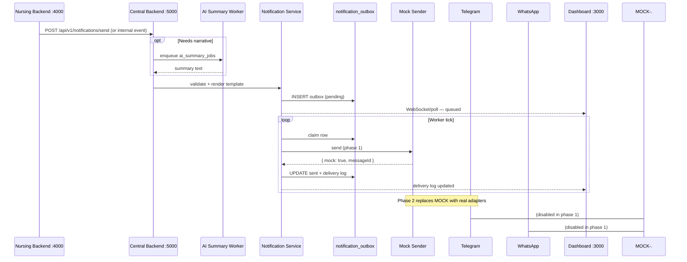
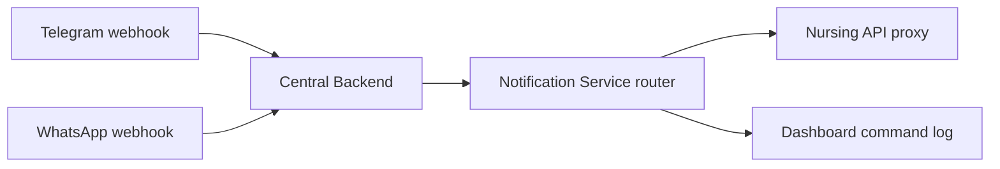

# WMC AI — Telegram & WhatsApp Integration Blueprint

**Location:** `D:\WMC-AI\wmc-ai-central-backend`  
**Status:** Architecture plan only — **no real API keys, no production sends yet**  
**Version:** 1.0 · 2026-05-20

**Related docs:**

- [CENTRAL-BACKEND-BLUEPRINT.md](./CENTRAL-BACKEND-BLUEPRINT.md)
- [docs/architecture/central-backend/06-notifications.md](../docs/architecture/central-backend/06-notifications.md)
- Repo integrations stub: `D:\WMC-AI\integrations/`

---

## Purpose

Connect alerts and updates from:

| Source | Examples |
|--------|----------|
| **Nursing Backend** (`:4000/api/v1`) | Vitals, escalations, handover, family queue, night shift |
| **Central Backend** (`:5000/api`) | Orchestration, auth, cross-domain rules |
| **Dashboard** (Frontdesk `:3000`) | Supervisor broadcasts, manual resend |
| **AI Summary Engine** | Handover narrative, risk brief, family draft text |

Deliver to:

| Channel | Audience |
|---------|----------|
| **Telegram** | Nurse group, supervisors, on-call |
| **WhatsApp** | Family updates (consent-based) |
| **WhatsApp** | Supervisor urgent alerts |
| **Dashboard** | Delivery log + status for ops |

**Phase 1 rule:** Use a **mock notification sender** only. Log payloads to DB + console; do not call Telegram/WhatsApp APIs until staging keys exist.

---

## 1. Notification types

Each type maps to a `template_key`, default channel(s), priority, and source system.

| Type ID | `template_key` | Default channel | Priority | Typical source |
|---------|----------------|-----------------|----------|----------------|
| Emergency alert | `emergency_alert` | Telegram nurse group + WhatsApp supervisor | Critical | Nursing `/emergency/respond`, command center |
| Doctor escalation | `doctor_escalation` | Telegram nurse group | Urgent | Nursing `/escalation/check`, supervisor queue |
| Fall risk alert | `fall_risk_alert` | Telegram nurse group | High | Nursing risk engine, dashboard summary |
| Pressure ulcer alert | `pressure_ulcer_alert` | Telegram nurse group | High | Turning / PU risk, tasks queue |
| Medication alert | `medication_alert` | Telegram nurse group | High | Nursing `/medication/check-alert` |
| Side turning reminder | `side_turning_reminder` | Telegram nurse group | Medium | Turning records, tasks queue |
| Shift handover | `shift_handover` | Telegram nurse group | Medium | `/handover/auto-generate`, AI summary |
| Family update | `family_update` | WhatsApp family | Medium | `/family/update`, AI draft (human approve) |
| Supervisor daily report | `supervisor_daily_report` | WhatsApp supervisor + Telegram | Low | `/reports/daily-facility`, command center |

### Payload shape (all types)

```json
{
  "notificationType": "doctor_escalation",
  "templateKey": "doctor_escalation",
  "channel": "telegram",
  "priority": "urgent",
  "patientId": "uuid-or-null",
  "patientName": "Ah Chong",
  "source": {
    "system": "nursing-backend",
    "endpoint": "/api/v1/supervisor/escalation-queue",
    "referenceId": "alert-uuid"
  },
  "variables": {
    "summary": "Low SpO2 — notify doctor",
    "recommendedAction": "Repeat vitals in 15 min"
  },
  "aiSummary": "optional text from AI Summary Engine",
  "idempotencyKey": "nursing:escalation:alert-uuid:telegram"
}
```

### Consent & routing rules

| Rule | Detail |
|------|--------|
| Family WhatsApp | `patients.consent_whatsapp = true` and valid E.164 on file |
| Supervisor WhatsApp | `staff.whatsapp_number` in allowlist |
| Telegram nurse group | `TELEGRAM_NURSE_GROUP_CHAT_ID` env (single group phase 1) |
| AI-generated family text | Status `draft` until nurse approves in dashboard or `/acknowledge` |

---

## 2. Message flow

End-to-end path from clinical event to channel delivery and dashboard visibility.



### Step-by-step (plain language)

1. **Nursing API** detects risk (vitals, escalation, task due) or dashboard triggers send.
2. Request hits **Central Backend** `POST /api/v1/notifications/send` (preferred) or nursing calls central via HTTP client.
3. **Notification Service** (`src/modules/notifications`) picks template, merges variables, optional **AI Summary** snippet.
4. Row written to **`notify.notification_outbox`** + **`notify.notification_deliveries`** (audit).
5. **Notification worker** (or inline mock in dev) calls **mock sender** — logs JSON, no external API.
6. **Dashboard** reads `GET /api/v1/notifications/logs` for status timeline.
7. **Phase 2:** Mock sender swapped for `integrations/telegram` and `integrations/whatsapp` real clients.

### Inbound (Telegram / WhatsApp → system)



---

## 3. Telegram bot plan

**Bot role:** Nurse group operations — alerts, handover, tasks, patient lookup, acknowledgements.

**Do not deploy real bot token until staging.** Use `MOCK_TELEGRAM=true` and log outbound/inbound payloads.

### Group & security

| Item | Plan |
|------|------|
| Audience | Single **nurse group** chat (`TELEGRAM_NURSE_GROUP_CHAT_ID`) |
| Webhook | `POST /api/v1/telegram/webhook` with secret header |
| Auth | Verify `X-Telegram-Bot-Api-Secret-Token` |
| Staff mapping | `notify.channel_bindings.telegram_chat_id` ↔ `staff.user_id` |

### Outbound (system → Telegram)

| Event | Message style |
|-------|----------------|
| Emergency | `🚨 EMERGENCY · {patientName}\n{summary}\nAction: {action}` |
| Doctor escalation | `⚕️ ESCALATION [{priority}] · {patientName}\n{reasons}` |
| Fall / PU / meds | `⚠️ {type} · {patientName}\n{detail}` |
| Side turning | `🔄 Turning due · {patientName} · {dueTime}` |
| Handover | `📋 Handover · {shift}\n{aiSummary or handoverSummary}` |

### Inbound commands

| Command | Behavior |
|---------|----------|
| `/handover` | Fetch `GET nursing/handover/auto-generate` → reply condensed summary |
| `/tasks` | Fetch `GET nursing/tasks/queue` → top 5 urgent tasks |
| `/risk` | Fetch dashboard summary + predictive risk (mock until live) → risk counts |
| `/patient {name}` | e.g. `/patient Ah Chong` → latest vitals + open alerts for patient |
| `/acknowledge {TASK-ID}` | Mark task/alert acknowledged; update nursing + log in `notification_deliveries` |

### Command router (module layout)

```
src/integrations/telegram/
├── mock-telegram.sender.ts      # Phase 1 — log only
├── telegram.client.ts             # Phase 2 — real Bot API
├── telegram.templates.ts          # Outbound message formatters
├── telegram.command-router.ts   # /handover, /tasks, …
└── telegram.webhook.handler.ts    # POST webhook entry
```

---

## 4. WhatsApp plan

**Provider:** Meta WhatsApp Cloud API (or WATI adapter in `integrations/` — pick one in phase 2).

**Phase 1:** `mock-whatsapp.sender.ts` only — no `WHATSAPP_ACCESS_TOKEN` in use.

### Message categories

| Category | Template (Meta) | Use case |
|----------|-----------------|----------|
| **Family update** | `wmc_family_update_v1` | Routine progress, nurse-approved text |
| **Supervisor urgent** | `wmc_supervisor_urgent_v1` | Critical facility / escalation rollup |
| **CRM / appointment** | `wmc_appointment_reminder_v1` | Lead follow-up, booking confirmation |

### Family update flow

1. Nurse creates update in nursing UI or family queue API.
2. Central backend enqueues `family_update` with `status: draft`.
3. AI Summary Engine optionally suggests `recommendedMessage`.
4. Nurse approves → `POST /api/v1/notifications/send` with `channel: whatsapp`.
5. Mock sender logs rendered template; dashboard shows **Sent (mock)**.

**Example template variables (family):**

```
Hello {{1}}, this is {{2}} from WMC.
Update regarding {{3}}: {{4}}
For questions call {{5}}.
```

### Supervisor urgent alert

- Trigger: command center `facilityStatus` ∈ `High Alert`, `Critical`, or `urgentCases >= 1`.
- Channel: WhatsApp to `staff.whatsapp_number` (supervisor role).
- Throttle: max 1 per facility per 15 minutes (`idempotencyKey`).

### CRM lead / appointment alert

- Source: Central CRM module or `wmc-ai-crm`.
- Channel: WhatsApp to lead `phone` (business-initiated template only outside 24h window).
- Link: `converted_patient_id` when lead becomes patient.

### WhatsApp module layout

```
src/integrations/whatsapp/
├── mock-whatsapp.sender.ts
├── whatsapp.client.ts             # Phase 2
├── whatsapp.templates.ts
├── whatsapp.webhook.handler.ts    # inbound, status callbacks
└── whatsapp.normalize-phone.ts    # E.164
```

---

## 5. Folder structure

Aligned with `wmc-ai-central-backend` and repo-level `integrations/`.

```
wmc-ai-central-backend/
├── NOTIFICATION-INTEGRATION-BLUEPRINT.md   # this file
├── src/
│   ├── modules/
│   │   └── notifications/
│   │       ├── notifications.routes.ts
│   │       ├── notifications.controller.ts
│   │       ├── notifications.service.ts      # enqueue, send, logs
│   │       ├── notifications.repository.ts
│   │       ├── mock-notification.sender.ts   # Phase 1 — all channels
│   │       ├── template-registry.ts
│   │       └── types.ts
│   └── integrations/
│       ├── telegram/
│       │   ├── mock-telegram.sender.ts
│       │   ├── telegram.command-router.ts
│       │   └── telegram.webhook.handler.ts
│       └── whatsapp/
│           ├── mock-whatsapp.sender.ts
│           └── whatsapp.webhook.handler.ts
├── apps/                                    # future
│   └── notification-worker/
│       └── src/worker.ts
└── database/migrations/
    ├── 00x_notify_outbox.sql
    └── 00x_notify_deliveries.sql

D:\WMC-AI\integrations/                      # shared contracts (optional symlink)
├── messaging/
│   ├── telegram/README.md
│   └── whatsapp/README.md
└── webhooks/README.md
```

### Module responsibilities

| Path | Responsibility |
|------|----------------|
| `modules/notifications` | Business API, outbox, logs, template keys, idempotency |
| `integrations/telegram` | Bot commands, group send, webhook parse |
| `integrations/whatsapp` | Templates, supervisor/family send, Meta webhook |
| `mock-notification.sender.ts` | Single entry: `{ channel, to, body }` → log + DB |

---

## 6. API routes

Mount on **Central Backend** under `/api/v1` (match existing gateway convention).

### Outbound & ops

| Method | Path | Auth | Description |
|--------|------|------|-------------|
| `POST` | `/api/v1/notifications/send` | JWT staff | Enqueue/send notification (mock phase 1) |
| `GET` | `/api/v1/notifications/logs` | JWT staff | Paginated delivery log + filters |
| `GET` | `/api/v1/notifications/logs/:id` | JWT staff | Single delivery detail |
| `POST` | `/api/v1/notifications/:id/retry` | Admin | Retry failed delivery |

**`POST /api/v1/notifications/send` (request)**

```json
{
  "templateKey": "doctor_escalation",
  "channel": "telegram",
  "recipient": { "type": "telegram_group", "chatId": "from-env-or-binding" },
  "variables": { "patientName": "Ah Chong", "summary": "Low SpO2" },
  "source": { "system": "nursing-backend", "referenceId": "..." },
  "idempotencyKey": "optional-stable-key"
}
```

**Response (mock phase 1)**

```json
{
  "deliveryId": "uuid",
  "status": "sent",
  "mock": true,
  "loggedAt": "2026-05-20T12:00:00Z",
  "preview": "⚕️ ESCALATION [Urgent] · Ah Chong\n..."
}
```

**`GET /api/v1/notifications/logs` (query)**

- `?channel=telegram|whatsapp`
- `?status=pending|sent|failed|mock_sent`
- `?patientId=`
- `?from=&to=` (ISO dates)

### Webhooks (provider → central)

| Method | Path | Auth | Description |
|--------|------|------|-------------|
| `POST` | `/api/v1/telegram/webhook` | Secret token | Telegram Bot API updates |
| `POST` | `/api/v1/whatsapp/webhook` | Meta signature | Messages + delivery status |

**Note:** Webhooks are **not** under `notifications/` path — separate routers in `integrations/*` mounted in `app.ts`.

### Nursing → Central bridge (internal)

| Caller | Pattern |
|--------|---------|
| Nursing backend | HTTP `POST http://localhost:5000/api/v1/notifications/send` with service token |
| Dashboard | Same, from Next.js server action or BFF |
| AI worker | On job complete → `family_update` draft or `shift_handover` enrich |

---

## 7. Mock notification sender (phase 1)

**No real API keys.** Environment flags:

```bash
# .env.example — central backend
NOTIFICATION_MODE=mock
MOCK_TELEGRAM=true
MOCK_WHATSAPP=true
# TELEGRAM_BOT_TOKEN=          # leave empty
# WHATSAPP_ACCESS_TOKEN=       # leave empty
TELEGRAM_NURSE_GROUP_CHAT_ID=mock-nurse-group
```

### Mock sender interface

```typescript
// src/modules/notifications/mock-notification.sender.ts (conceptual)

type MockSendInput = {
  channel: 'telegram' | 'whatsapp'
  to: string
  templateKey: string
  body: string
  metadata: Record<string, unknown>
}

type MockSendResult = {
  mock: true
  messageId: string   // uuid
  loggedAt: string
  preview: string
}

async function mockSend(input: MockSendInput): Promise<MockSendResult>
```

### Behavior

1. Write `notification_deliveries` row: `status = mock_sent`, `provider_message_id = mock-{uuid}`.
2. `console.info('[MOCK NOTIFY]', JSON.stringify(input))` in development.
3. Return success to caller so nursing/dashboard flows can be tested end-to-end.
4. Dashboard **Notification log** panel shows mock deliveries with amber **Mock** badge.

### Phase 2 swap

Replace `mock-notification.sender` with:

```typescript
if (config.notificationMode === 'mock') return mockSend(input)
if (input.channel === 'telegram') return telegramClient.send(input)
return whatsappClient.send(input)
```

---

## Database tables (summary)

| Table | Purpose |
|-------|---------|
| `notify.notification_outbox` | Queued jobs before send |
| `notify.notification_deliveries` | Per-attempt log (mock or real) |
| `notify.channel_bindings` | Telegram chat ID, WhatsApp E.164 per user/patient |
| `notify.template_versions` | Optional: versioned body templates |

---

## Dashboard integration

| UI area | Data source |
|---------|-------------|
| Command Center → Notification log widget | `GET /api/v1/notifications/logs` |
| AI insights → Family queue | Approve → `POST .../send` |
| Per-widget “Degraded” badge | Already pattern from nursing fetch; extend for notify |

---

## Implementation phases

| Phase | Deliverable |
|-------|-------------|
| **1** | `mock-notification.sender`, `POST /send`, `GET /logs`, DB migrations |
| **2** | Template registry for all 9 notification types |
| **3** | Telegram webhook + command router (mock inbound) |
| **4** | WhatsApp webhook stub + template render (mock) |
| **5** | Wire nursing events → central send (escalation, emergency, family) |
| **6** | AI Summary enriches handover + family draft |
| **7** | Real Telegram bot (staging keys) |
| **8** | Real WhatsApp Cloud API (staging keys) |

---

## Security checklist (before production)

- [ ] No API keys in git; use secret manager
- [ ] Webhook signature verification enabled
- [ ] Rate limits on `/notifications/send`
- [ ] Family messages require explicit approve step
- [ ] Audit log for all sends and `/acknowledge`
- [ ] PHI minimization in Telegram group messages

---

*End of blueprint — planning only; implement mock sender before any real provider integration.*
